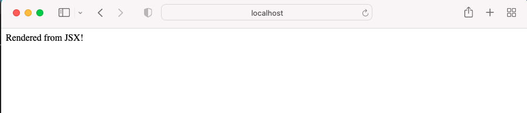
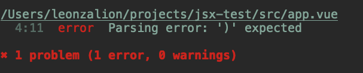
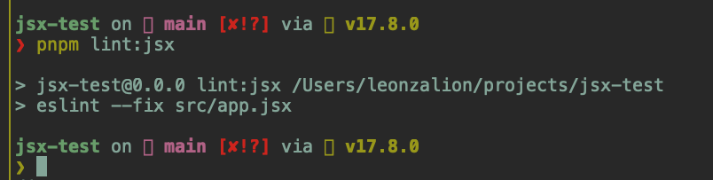

# Vue ESLint Plugin JSX Bug

Install dependencies:
```shell
npm install
```

Running the app works as expected:

```shell
npm run dev
```

Output in the browser:



But linting the project gives the following error:

```shell
npm run lint
```



Linting the equivalent code in a JSX file works fine:

```shell
npm run lint:jsx
```


