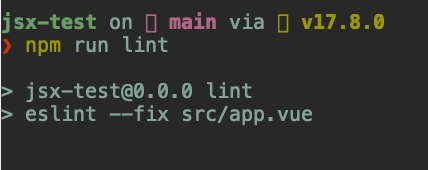

# Vue ESLint Plugin JSX Bug

link https://github.com/microsoft/TypeScript/issues/60125

link https://github.com/typescript-eslint/typescript-eslint/issues/9934

link https://github.com/vuejs/eslint-plugin-vue/issues/2304

link https://github.com/vuejs/vue-eslint-parser/issues/150

---

For any friends who have found this, if you are using the `@typescript-eslint/consistent-type-exports` ESLint rule and it has caused the `<script lang='tsx' setup>` in Vue to fail to be linted and parsed, resulting in the error `error  Parsing error: '>' expected`,

Solution:
- If you continue to use the `consistent-type-exports` rule, please patch the `typescript` compiler with [typescript.patch](https://github.com/leondreamed-archives/vue-eslint-plugin-jsx-bug/blob/main/patches/typescript%2B4.6.3.patch).
- If you only use `consistent-type-imports` and not `consistent-type-exports`, then please set `parserOptions.project` and `parserOptions.projectService` in `.eslintrc.js` to `false`.

> [consistent-type-exports](https://typescript-eslint.io/rules/consistent-type-exports/)
> 
> This rule requires type information to run, which comes with performance tradeoffs.
---


Install dependencies:
```shell
npm install
```

Running the app works as expected:

```shell
npm run dev
```

Output in the browser:


But linting the project gives the following error:

```shell
npm run lint
```


Linting the equivalent code in a JSX file works fine:

```shell
npm run lint:jsx
```


However, linting works after applying [a very hacky patch](https://github.com/leonzalion/vue-eslint-plugin-jsx-bug/blob/main/patches/typescript%2B4.6.3.patch) to the TypeScript compiler:

```shell
npx patch-package
num run lint
```




## element-plus


