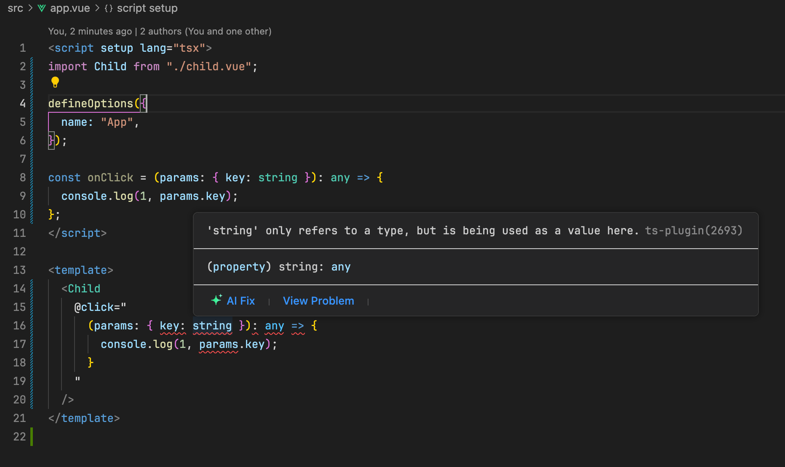

# Vue v-on inline function type hint error

In VSCode, there is a TypeScript plugin error prompt. However, using vue-tsc can detect the error. But the eslint-plugin-vue check passes.

```vue
<template>
  <Child
    @click="
      (params: { key: string }): any => {
        console.log(1, params.key);
      }
    "
  />
</template>
```

